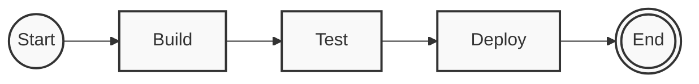
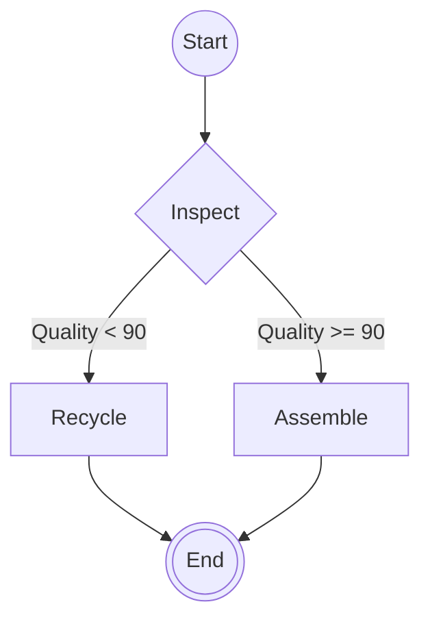
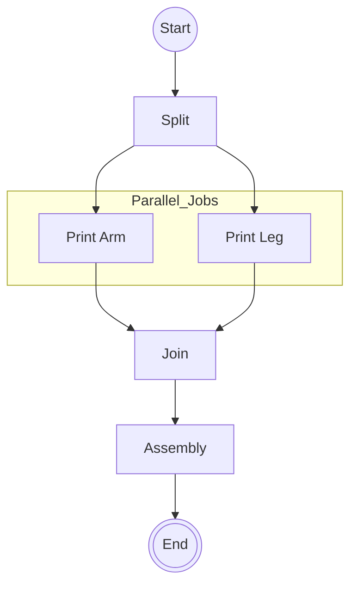
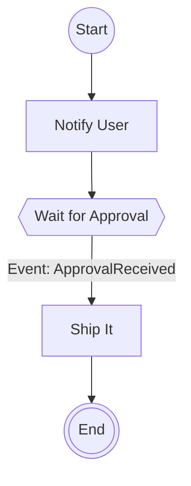

1. **DevOps:** Visualizing CI/CD pipelines.
2. **Production:** Visualizing physical manufacturing steps (3D printing, assembly) for the operator UI.

---

# PRD: `cncf-workflow-mermaid`

**Version:** 0.1.0-draft
**License:** MIT
**Repository:** `github.com/webtree/cncf-workflow-mermaid` (Proposed)
**Package Name:** `@webtree/workflow-mermaid`

## 1. Executive Summary

A lightweight, zero-dependency TypeScript library that converts **CNCF Serverless Workflow (v/1.0)** JSON/YAML definitions into **Mermaid.js** graph syntax. It is designed to be the "view layer" for Temporal-backed state machines, enabling developers and manufacturing operators to visualize complex logic instantly.

## 2. Core Design Principles

* **Zero Logic, Just View:** The library does not execute code; it only projects the definition into a visual graph.
* **Robustness:** It must handle broken/incomplete definitions gracefully (rendering a "red node" for errors instead of crashing).
* **Styling Hooks:** It must support custom CSS classes (critical for MakeLocal to highlight "Dangerous" steps like *Heat Bed* vs "Safe" steps like *Cool Down*).

## 3. Architecture

**Input:**

* A Javascript Object representing the CNCF Workflow (user handles YAML parsing before calling).

**Output:**

* A `string` containing valid Mermaid syntax (`graph TD ...`).

**API Signature:**

```typescript
interface MermaidOptions {
  direction?: 'TD' | 'LR';     // Top-Down (Pipeline) or Left-Right (Manufacturing)
  theme?: 'default' | 'dark';
  highlightCurrentState?: string; // e.g., "heat_bed" -> adds specific border to this node
}

export function toMermaid(workflow: WorkflowDefinition, options?: MermaidOptions): string;

```

---

## 4. Test Cases & Visual Verification

We will use **Visual Snapshot Testing**. The CI pipeline will generate `.mmd` files and render them to PNGs using the Mermaid CLI. If a PR changes the pixel output, it flags a warning.

Below are the 4 core scenarios we must support, with their definitions and **expected visual output**.

### Scenario A: The "Linear CI Pipeline"

*Use Case:* A standard software release cycle.
*Complexity:* Low. Sequential states.

**Input (JSON Concept):**

```json
{
  "id": "ci_pipeline",
  "start": "Build",
  "states": [
    { "name": "Build", "type": "operation", "transition": "Test" },
    { "name": "Test", "type": "operation", "transition": "Deploy" },
    { "name": "Deploy", "type": "operation", "end": true }
  ]
}

```

**Expected Visual:**



---

### Scenario B: The "Quality Control Switch" (Branching)

*Use Case:* Manufacturing. A 3D printed part is inspected. If bad, recycle; if good, assemble.
*Complexity:* Medium. Requires `switch` (diamond) nodes.

**Input (JSON Concept):**

```json
{
  "id": "quality_check",
  "start": "Inspect",
  "states": [
    {
      "name": "Inspect",
      "type": "switch",
      "dataConditions": [
        { "condition": "${ .quality < 90 }", "transition": "Recycle" },
        { "condition": "${ .quality >= 90 }", "transition": "Assemble" }
      ]
    },
    { "name": "Recycle", "type": "operation", "end": true },
    { "name": "Assemble", "type": "operation", "end": true }
  ]
}

```

**Expected Visual:**



---

### Scenario C: The "Parallel Manufacturing"

*Use Case:* Printing different parts of a robot simultaneously on different machines.
*Complexity:* High. Requires `parallel` sub-graphs.

**Input (JSON Concept):**

```json
{
  "id": "make_robot",
  "start": "PrintAll",
  "states": [
    {
      "name": "PrintAll",
      "type": "parallel",
      "branches": [
        { "name": "Arm", "workflowId": "print_arm" },
        { "name": "Leg", "workflowId": "print_leg" }
      ],
      "transition": "Assembly"
    },
    { "name": "Assembly", "type": "operation", "end": true }
  ]
}

```

**Expected Visual:**



---

### Scenario D: The "Human-in-the-Loop" (Event Wait)

*Use Case:* The system pauses until a human operator physically presses a button or an API event arrives.
*Complexity:* Visualizing "Waiting" states distinctively.

**Input (JSON Concept):**

```json
{
  "id": "wait_for_user",
  "start": "NotifyUser",
  "states": [
    { "name": "NotifyUser", "type": "operation", "transition": "WaitForApproval" },
    { 
      "name": "WaitForApproval", 
      "type": "event", 
      "onEvents": [{ "eventRefs": ["ApprovalReceived"], "transition": "ShipIt" }]
    },
    { "name": "ShipIt", "type": "operation", "end": true }
  ]
}

```

**Expected Visual:**
*(Note the hexagonal shape or different styling for the event wait)*



---

## 5. Development Roadmap

### Phase 1: The Core (Week 1)

* **Setup:** Repo, TS config, Vitest.
* **Parser:** Implement `State` traversal (only `operation` and `switch`).
* **Visual Test:** Setup `mermaid-cli` to generate PNGs for Phase 1.

### Phase 2: Advanced Flows (Week 2)

* **Parallelism:** Implement Mermaid `subgraph` support.
* **Events:** Implement special shapes (`{{ }}`) for Event states.
* **Styling:** Add the `highlightCurrentState` feature (essential for your Temporal UI to show "Current Step" in green).

### Phase 3: The Playground (Week 3)

* Create a simple `index.html` in the repo that contains a textarea (for JSON) and a live Mermaid render, so contributors can debug easily.
